# React Clean Architecture

A modular **Clean Architecture + Domain-Driven Design** reference implementation for React and TypeScript.

This project demonstrates how to build a frontend application where **domain logic, application logic, infrastructure, transport, and presentation remain independently replaceable**.

It is designed as both:

- 📚 A reference for learning Clean Architecture and DDD in TypeScript
- 🏗️ A starting point for building production applications
- 🧪 An example of how to keep application logic highly testable
- 🔌 A demonstration of replaceable persistence and message transports
- 🧩 A modular architecture that can grow with the business

> **The goal is not to create the largest possible abstraction stack.**
>
> The goal is to establish clear boundaries so that the application can evolve without forcing unrelated parts of the system to evolve with it.

---

## ✨ Highlights

- 🧠 Domain-driven design
- 🏛️ Clean Architecture
- 🧩 Feature/module-oriented organization
- 🔄 CQRS with commands and queries
- 🚌 Replaceable message buses
- 💾 Persistence abstraction with IndexedDB
- 🌐 Browser/server infrastructure separation
- 🗃️ Application-owned persistence ports
- 🧱 Entities and Value Objects
- 📦 DTOs and primitive representations
- ⚡ Application-level caching
- 🏷️ Tag-based cache invalidation
- 🔌 Replaceable infrastructure implementations
- 🧪 Architecture designed for unit and integration testing
- 🔒 Strict TypeScript
- ⚛️ React + React Router
- 🐳 Docker support

---

## 📖 Table of Contents

- [Philosophy](#-philosophy)
- [Architecture](#-architecture)
- [Dependency Rule](#-dependency-rule)
- [Project Structure](#-project-structure)
- [Modules](#-modules)
- [Domain Layer](#-domain-layer)
- [Application Layer](#-application-layer)
- [Infrastructure Layer](#-infrastructure-layer)
- [CQRS](#-cqrs)
- [Commands and Queries](#-commands-and-queries)
- [Message Buses](#-message-buses)
- [Serialization](#-serialization)
- [Caching](#-caching)
- [Persistence](#-persistence)
- [DTOs and Primitives](#-dtos-and-primitives)
- [Dependency Injection](#-dependency-injection)
- [Browser and Server](#-browser-and-server)
- [React / Presentation](#-react--presentation)
- [Adding a New Feature](#-adding-a-new-feature)
- [Example](#-example)
- [Testing](#-testing)
- [Architecture Rules](#-architecture-rules)
- [Development](#-development)
- [Docker](#-docker)
- [Contributing](#-contributing)
- [Design Principles](#-design-principles)
- [What This Project Is Not](#-what-this-project-is-not)
- [Roadmap](#-roadmap)
- [License](#-license)

---

## 🧠 Philosophy

Clean Architecture is not primarily about folders.

It is about **dependency direction**.

The most important rule in this project is:

> **Inner layers must not depend on outer layers.**

The domain should not know that React exists.

The application should not know that IndexedDB exists.

A use case should not know whether it is running in a browser, a server, a worker, or another environment.

Infrastructure adapts external technologies to the abstractions required by the application.

The composition root puts everything together.

---

## 🏛️ Architecture

At a high level:

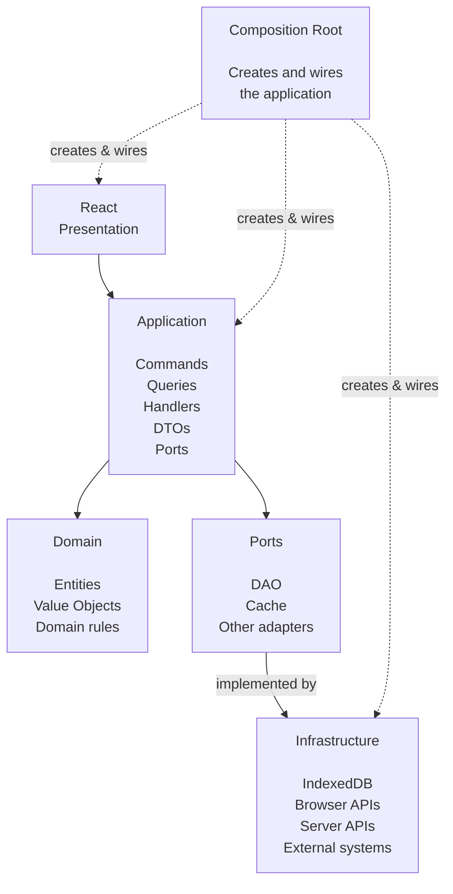

The dependency direction is therefore:

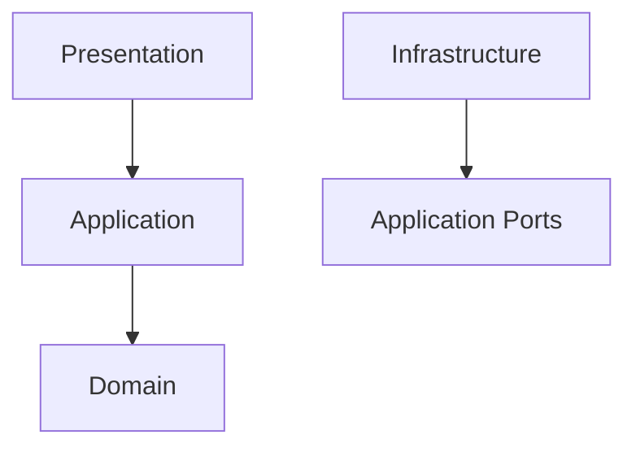

Infrastructure points inward by implementing interfaces owned by the application.

---

## 🔐 Dependency Rule

The architecture can be summarized with this matrix:

| Layer          | Domain | Application | Infrastructure | React |
|----------------|--------|-------------|----------------|-------|
| Domain         | ✅      | ❌           | ❌              | ❌     |
| Application    | ✅      | ✅           | ❌              | ❌     |
| Infrastructure | ✅      | ✅           | ✅              | ❌     |
| Presentation   | ❌      | ✅           | ❌              | ✅     |

The important part is not the directory names.

The important part is that the dependency graph follows these rules.

For example:

```ts
// Application
export interface EntityDao {
  count(): Promise<number>;
}
```

Infrastructure implements it:

```ts
// Infrastructure
export class EntityIndexedDbDao implements EntityDao {
  async count(): Promise<number> {
    // IndexedDB implementation
  }
}
```

The application depends on the abstraction:

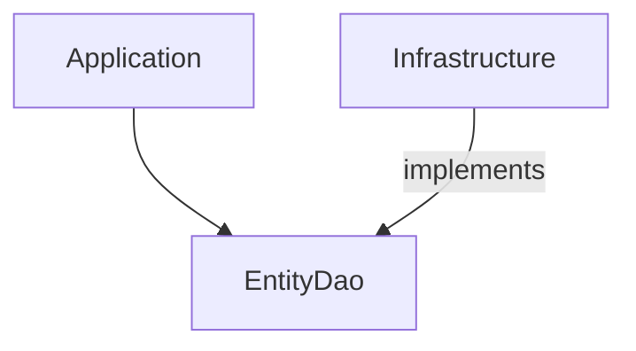

It does **not** depend on `EntityIndexedDbDao`.

---

## 📁 Project Structure

The repository is organized primarily by module, with architectural layers inside each module.

```text
.
├── app/
│   ├── bootstrap/
│   ├── components/
│   ├── contexts/
│   ├── hooks/
│   ├── layouts/
│   ├── pages/
│   ├── providers/
│   └── root.tsx
│
├── di/
│   ├── container.browser.ts
│   ├── container.server.ts
│   └── types.ts
│
├── modules/
│   ├── common/
│   │   ├── auth/
│   │   ├── state/
│   │   └── users/
│   │
│   ├── shared/
│   │   ├── cookies/
│   │   ├── data/
│   │   ├── jwt/
│   │   └── value-objects/
│   │
│   └── demo/
│       ├── entities/
│       ├── use-cases/
│       ├── infrastructures/
│       └── overview/
│
├── public/
│
├── Dockerfile
├── package.json
├── pnpm-lock.yaml
├── pnpm-workspace.yaml
├── react-router.config.ts
├── tsconfig.json
└── vite.config.ts
```

---

## 🧩 Modules

The application is **module-oriented**, rather than globally organized by technical layer.

Instead of:

```text
domain/
application/
infrastructure/
```

the project groups related business concepts:

```
modules/
  entities/
  use-cases/
  infrastructures/
  overview/
```

Each module can then contain its own:

```text
domain/
application/
infrastructure/
```

This keeps related functionality together and makes the architecture easier to navigate as the system grows.

---

## 🧠 Domain Layer

The domain layer contains business concepts and rules.

Typical domain objects include:

- Entities
- Value Objects
- Aggregates
- Domain services
- Domain errors
- Domain rules

The domain should be independent of:

- React
- IndexedDB
- HTTP
- Browser APIs
- Database implementations
- UI components
- Transport protocols

For example:

```ts
export class EntityEntity extends Entity<
  IdValue,
  EntityPrimitives
> {
  constructor(
    id: IdValue,
    readonly type: TypeValue,
    readonly name: NameValue,
    readonly description: DescriptionValue,
    readonly fields: FieldsValue,
  ) {
    super(id);
  }
}
```

The domain model expresses the concept itself rather than how the concept is stored or displayed.

---

## 💎 Value Objects

Value Objects are used when a value has domain meaning and invariants.

For example:

```ts
const name = new NameValue("Customer");
```

instead of:

```ts
const name = "Customer";
```

This allows the value object to enforce its own rules.

For example:

```text
NameValue
   │
   ├── validation
   ├── normalization
   └── representation
```

Value Objects are particularly useful for:

- IDs
- Names
- Types
- Descriptions
- Structured collections
- Domain-specific values

---

## ⚙️ Application Layer

The application layer coordinates the execution of business operations.

It contains things such as:

```text
application/
├── commands/
├── queries/
├── command-handlers/
├── query-handlers/
├── dtos/
└── interfaces/
```

The application layer answers:

> What does the system need to do?

while the domain answers:

> What are the business rules?

and infrastructure answers:

> How do we technically do it?

---

## 🔌 Application Ports

Application code owns the abstractions it needs.

For example:

```ts
export interface EntityDao {
  count(): Promise<number>;
  getAll(): Promise<EntityEntity[]>;
}
```

The interface belongs to the application because the application requires that capability.

Infrastructure implements it:

```ts
export class EntityIndexedDbDao
  implements EntityDao
{
  // IndexedDB implementation
}
```

This means persistence can later change without modifying the application:

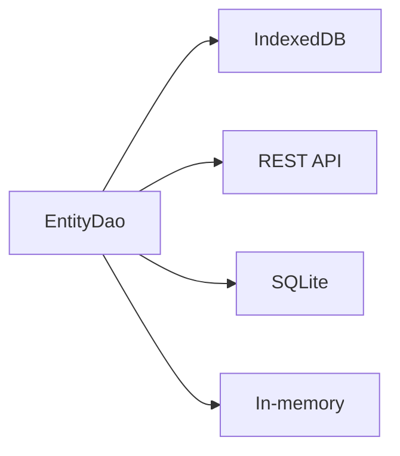

---

## 🔄 CQRS

The project uses CQRS to separate **state-changing operations** from **read operations**.

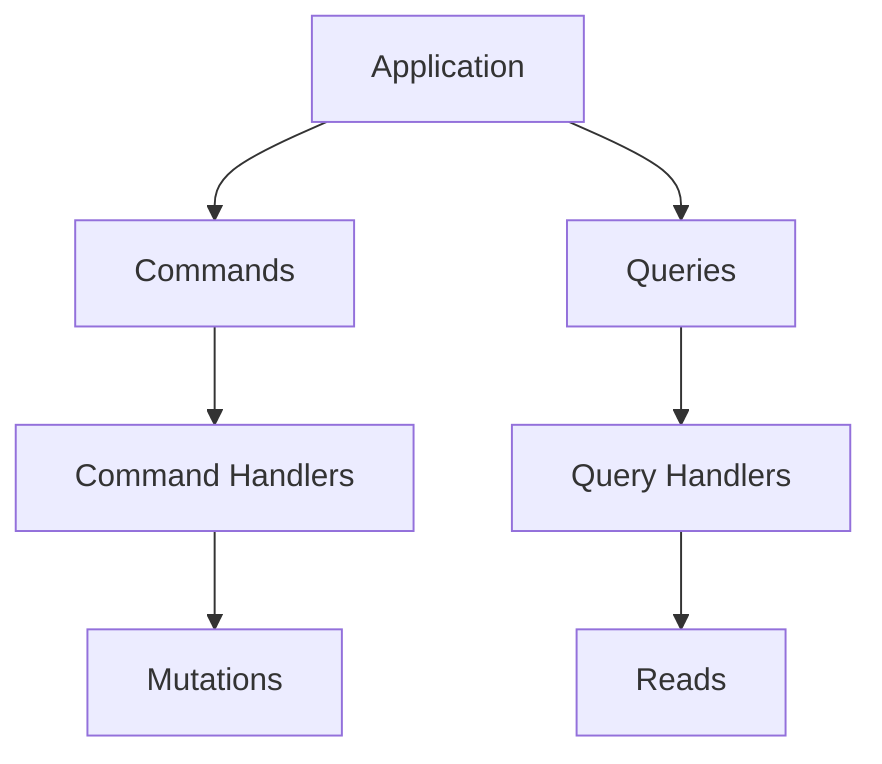

### Commands

Commands represent an intention to change state.

Examples:

```text
CreateEntity
UpdateEntity
DeleteEntity
CreateUseCase
UpdateInfrastructure
```

Commands should describe **what the user/system wants to happen**, rather than how it should happen.

---

### Queries

Queries retrieve information without changing application state.

Examples:

```text
GetEntity
GetAllEntities
GetOverview
GetAllUseCases
GetAllInfrastructures
```

A query handler typically:

1. Receives a query
2. Reads through application ports
3. Builds an application DTO
4. Returns the result

---

## 🚌 Message Buses

Commands and queries are executed through buses.

The application can work with different bus implementations:

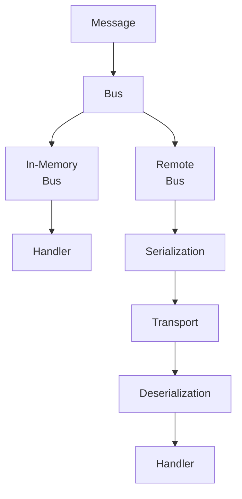

The current application can use an in-memory bus because queries and commands execute inside the same process.

A remote implementation can serialize messages when communication with another process or system is required.

---

## 📦 Serialization

Serialization is a transport concern.

An in-memory message does not need to be serialized:

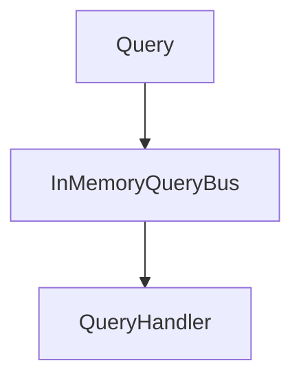

A remote message may require:

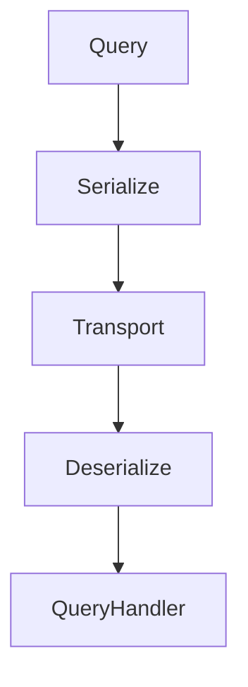

This allows the same application-level messages to be used with different transport mechanisms.

---

## ⚡ Caching

Queries can be cached at the application level.

The purpose is to keep caching behavior close to the operation being cached rather than forcing the presentation layer to understand cache internals.

Conceptually:

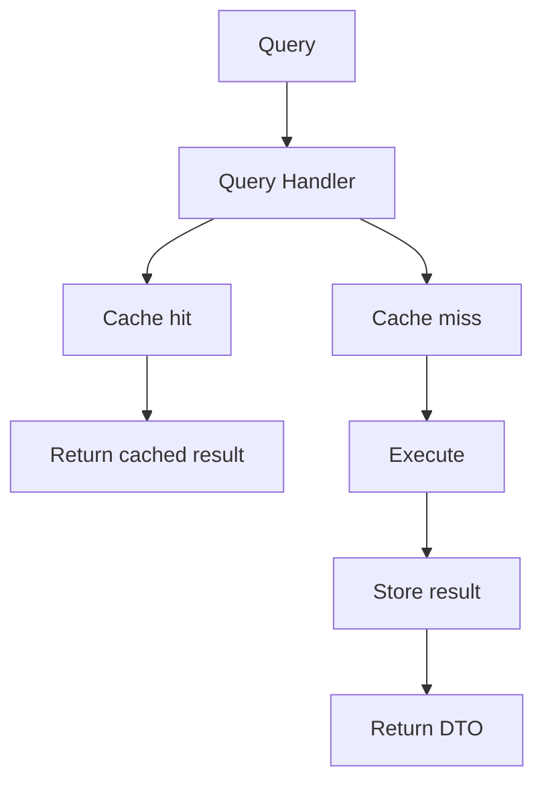

---

### 🏷️ Tag-Based Cache Invalidation

Commands can invalidate cached queries through tags.

For example:

```text
GetAllEntities
    tags:
      entities
```

A mutation:

```text
CreateEntity
    invalidates:
      entities
```

can automatically invalidate related cached results.

This avoids coupling React components to persistence or cache management.

The conceptual flow is:

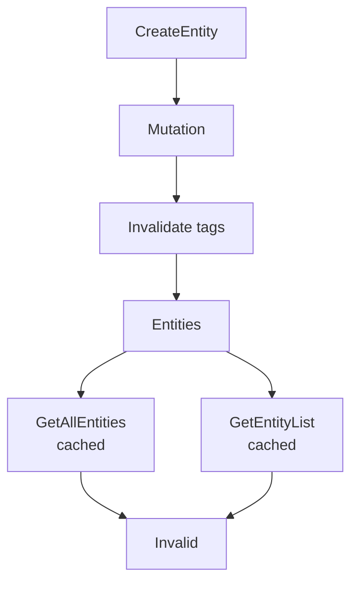

This becomes particularly useful as the number of queries grows.

---

## 💾 Persistence

The current example uses IndexedDB.

Persistence is hidden behind application-owned interfaces.

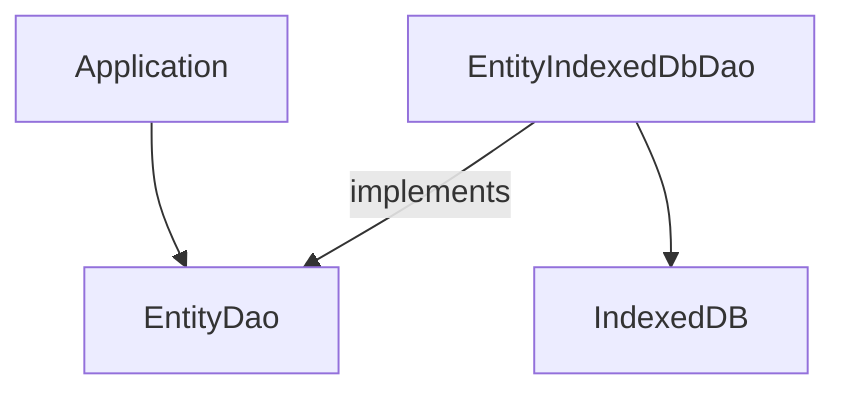

The application does not need to know:

- object store names
- IndexedDB transactions
- browser database APIs
- persistence schemas
- database-specific implementation details

---

### 🧱 Persistence Schemas vs Domain Objects

Persistence models and domain models are intentionally separate.

For example:

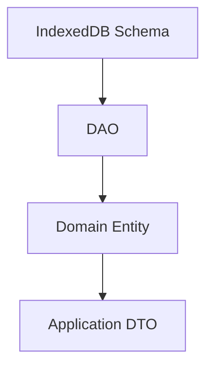

A database schema can therefore contain persistence-specific properties without forcing those properties into the domain model.

This allows persistence concerns to evolve independently.

---

## 📦 DTOs and Primitives

Different boundaries have different representations.

A simplified flow is:

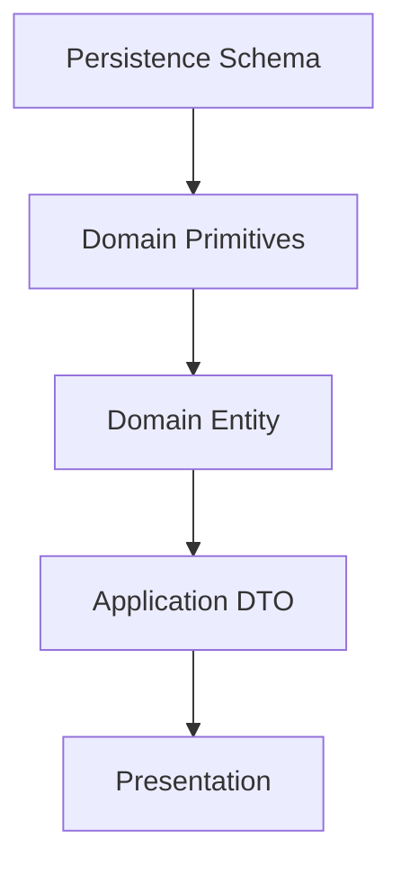

For example:

```ts
entity.toPrimitives()
```

can produce a representation suitable for application-level serialization.

The important rule is:

> A persistence representation does not have to be the domain model.

---

## 🔧 Dependency Injection

The composition root is responsible for wiring implementations together.

Conceptually:

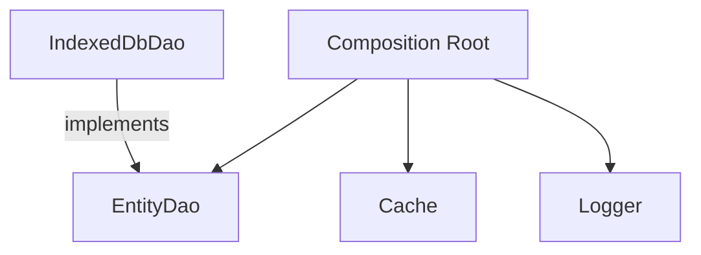

This keeps construction decisions outside the domain and application logic.

For example:

```text
EntityDao
    │
    └── EntityIndexedDbDao
```

can later become:

```text
EntityDao
    │
    ├── EntityIndexedDbDao
    ├── EntityApiDao
    ├── EntityMemoryDao
    └── EntityMockDao
```

without changing the application code that consumes `EntityDao`.

---

## 🌐 Browser and Server

The application supports different infrastructure implementations for different environments.

For example:

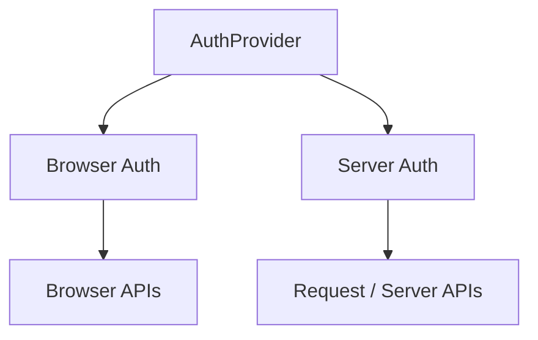

The application depends on the abstraction:

```ts
AuthProvider
```

while the composition root chooses the environment-specific implementation.

This allows the same application concepts to operate in different runtimes.

---

## ⚛️ React / Presentation

React belongs to the outermost presentation layer.

Components should not directly manipulate:

```text
IndexedDB
JWT implementation
DAO implementations
database schemas
domain persistence
```

Instead, the presentation layer invokes application operations.

Conceptually:

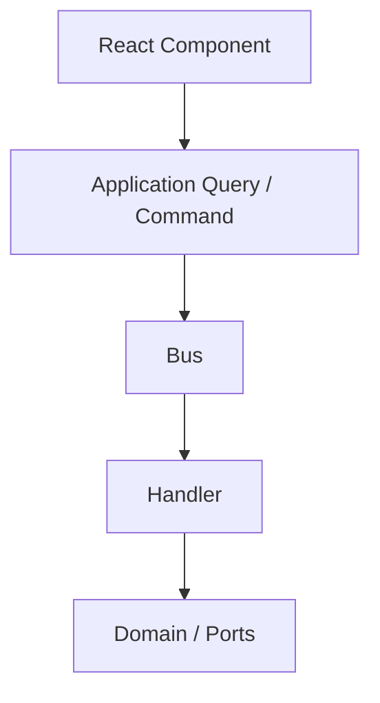

This keeps UI code focused on presentation.

---

## 🧭 Adding a New Feature

When adding a new business capability, start from the domain concept rather than the technology.

For example, suppose we want to add `Products`.

A possible structure is:

```text
modules/
└── products/
    ├── domain/
    │   ├── entities/
    │   ├── value-objects/
    │   └── errors/
    │
    ├── application/
    │   ├── commands/
    │   ├── queries/
    │   ├── command-handlers/
    │   ├── query-handlers/
    │   ├── dtos/
    │   └── interfaces/
    │
    └── infrastructure/
        ├── database/
        │   ├── schemas/
        │   └── dao/
        └── ...
```

---

## 🛠️ Example: Adding a Product Query

Define the query:

```ts
export class GetProductQuery {
  constructor(
    readonly id: string,
  ) {}
}
```

Define the application port:

```ts
export interface ProductDao {
  getById(id: string): Promise<ProductEntity | null>;
}
```

Implement the port:

```ts
export class ProductIndexedDbDao
  implements ProductDao
{
  async getById(id: string) {
    // IndexedDB implementation
  }
}
```

Create the handler:

```ts
export class GetProductQueryHandler {
  constructor(
    private readonly productDao: ProductDao,
  ) {}

  async execute(
    query: GetProductQuery,
  ): Promise<ProductDto | null> {
    const product =
      await this.productDao.getById(query.id);

    if (!product) {
      return null;
    }

    return product.toPrimitives();
  }
}
```

Register the handler with the query bus:

```ts
queryBus.register(
  GetProductQuery,
  getProductQueryHandler,
);
```

Then React only needs to execute the query:

```ts
const product = await queryBus.execute(
  new GetProductQuery(productId),
);
```

React doesn't need to know how the product is persisted.

---

## 🧪 Testing

The architecture is intentionally designed so that each layer can be tested independently.

### Domain tests

Test:

```text
Entities
Value Objects
Domain rules
Domain errors
```

without React, IndexedDB, or external services.

---

### Application tests
[.env.example](.env.example)
Application services and handlers can use fake ports:

```ts
const productDao = new FakeProductDao();

const handler =
  new GetProductQueryHandler(productDao);

const result = await handler.execute(
  new GetProductQuery("product-id"),
);
```

No database is required.

---

### Infrastructure tests

Infrastructure implementations can be tested against their actual technology.

For example:

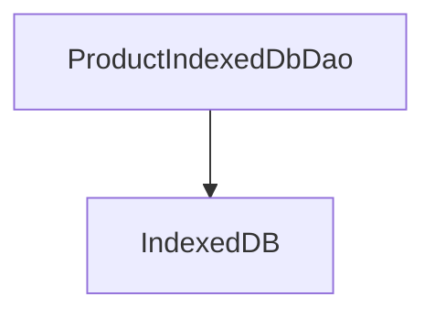

These tests verify that the adapter correctly translates between the persistence model and the application/domain model.

---

### Architecture tests

The project should also enforce architectural boundaries.

Examples:

```text
Domain
  ❌ React
  ❌ IndexedDB
  ❌ Browser APIs
  ❌ Infrastructure

Application
  ❌ React
  ❌ Infrastructure implementations
  ❌ Browser APIs

Infrastructure
  ✅ Implements application ports

Presentation
  ✅ Uses application layer
```

Architecture tests are especially valuable because they prevent accidental dependency violations as the project grows.

---

## 🧱 Architecture Rules

When contributing code, keep these rules in mind.

### Rule 1 — Business logic belongs in the domain

If something represents a business invariant, it should not live inside a React component.

---

### Rule 2 — Application coordinates use cases

The application layer orchestrates operations.

It should not know how those operations are technically implemented.

---

### Rule 3 — Infrastructure implements ports

Infrastructure adapts technologies to application-owned abstractions.

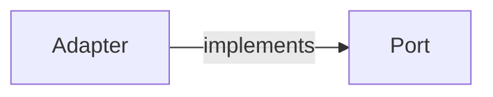

### Rule 4 — React is an outer layer

React should not become the place where business rules live.

---

### Rule 5 — Don't create abstractions without a reason

A repository, service, factory, aggregate, adapter, or interface should exist because it solves a real architectural or domain problem.

Avoid abstraction for abstraction's sake.

---

### Rule 6 — Model the business, not the architecture

Prefer:

```text
orders
products
inventory
payments
```

when those are actual business concepts.

Architectural patterns should support the domain rather than dictate it.

---

### Rule 7 — Share domain concepts intentionally

A concept should belong to `common` only when it is intentionally shared across bounded contexts.

Technical utilities without domain meaning belong in `shared`.

---

## 🔄 Example Dependency Flow

Consider creating an entity:

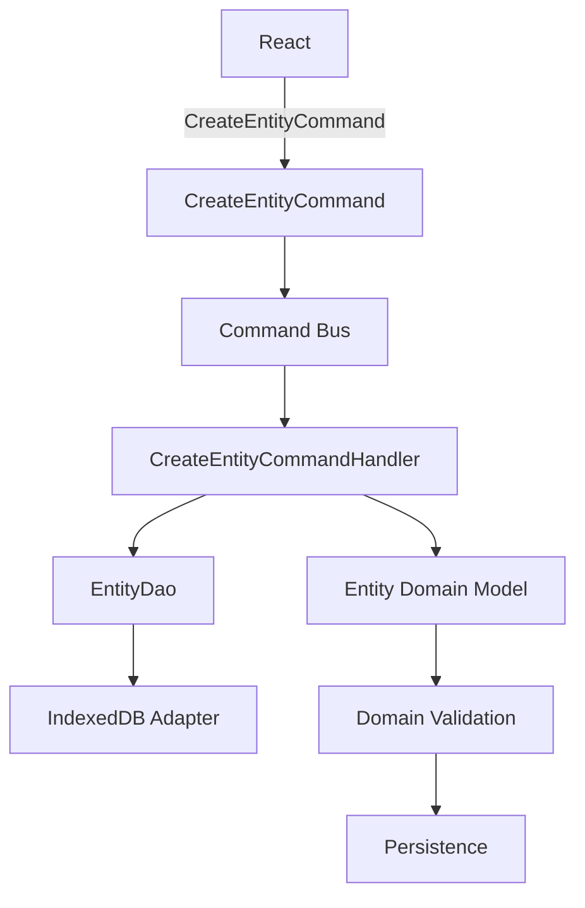

At no point does the domain need to know:

```text
React
IndexedDB
HTTP
Browser APIs
```

---

## 🌍 Replaceable Infrastructure

One of the benefits of the architecture is that infrastructure can change without rewriting application logic.

For example:

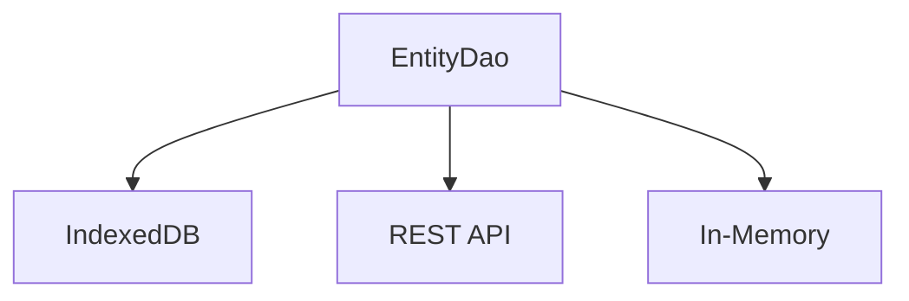

The application continues to depend on:

```ts
EntityDao
```

rather than the implementation.

This is particularly useful for:

- testing
- migrations
- SSR
- offline applications
- different deployment environments
- future backend integration

---

## 🚀 Getting Started

### Requirements

- Node.js
- pnpm

Install dependencies:

```shell
pnpm install
```

Start development:

```shell
pnpm dev
```

Type-check the project:

```shell
pnpm typecheck
```

Build:

```shell
pnpm build
```

Run the production build:

```shell
pnpm start
```

---

## 🐳 Docker

The project also includes a Dockerfile.

Build the image:

```shell
docker build -t react-clean-architecture .
```

Run it:

```shell
docker run -p 3000:3000 react-clean-architecture
```

---

## 🧰 Technology Stack

| Technology   | Purpose              |
| ------------ | -------------------- |
| React        | UI                   |
| React Router | Routing              |
| TypeScript   | Type safety          |
| Vite         | Build tooling        |
| Tailwind CSS | Styling              |
| IndexedDB    | Browser persistence  |
| Inversify    | Dependency injection |
| pnpm         | Package management   |
| Docker       | Containerization     |

---

## 📚 Architectural Concepts Demonstrated

This repository intentionally demonstrates several concepts together:

### Clean Architecture

Dependency direction and separation of concerns.

### Domain-Driven Design

Business-oriented modules, entities, value objects, and domain boundaries.

### CQRS

Separating commands from queries.

### Dependency Inversion

Application-owned ports implemented by infrastructure.

### Hexagonal Architecture

Infrastructure adapters surrounding application/domain ports.

### DTOs

Keeping application-facing data separate from domain objects.

### Persistence Mapping

Keeping database schemas independent from domain models.

### Message Transport Abstraction

Allowing in-process and serialized/remote messages.

### Cache Invalidation

Application-level caching with tag-based invalidation.

---

## 🧭 Clean Architecture vs DDD

These concepts are related, but they solve different problems.

Clean Architecture primarily answers:

> How should dependencies be organized?

DDD primarily answers:

> How should software represent and evolve with the business domain?

This project uses both.

A simplified view:

```mermaid
flowchart TD
  DDD["DDD"]

  DOMAIN_MODEL["Domain Model"]
  BOUNDED_CONTEXTS["Bounded Contexts"]

  CLEAN["Clean Architecture"]

  DOMAIN["Domain"]
  APPLICATION["Application"]
  INFRASTRUCTURE["Infrastructure"]

  DDD --> DOMAIN_MODEL
  DDD --> BOUNDED_CONTEXTS

  DOMAIN_MODEL --> CLEAN
  BOUNDED_CONTEXTS --> CLEAN

  CLEAN --> DOMAIN
  CLEAN --> APPLICATION
  CLEAN --> INFRASTRUCTURE
```

The architecture should serve the domain rather than become the domain.

---

## 🧠 Design Principles

The project follows these general principles:

### High cohesion

Keep related concepts together.

### Low coupling

Avoid unnecessary dependencies between modules.

### Dependency inversion

Depend on abstractions owned by the consuming layer.

### Explicit boundaries

Make architectural boundaries visible in the codebase.

### Replaceability

Infrastructure should be replaceable without rewriting application logic.

### Testability

Business and application logic should be testable without requiring external systems.

### Business language

Domain concepts should reflect the language of the business.

### Pragmatism

Do not introduce a pattern merely because a pattern exists.

---

## 🤝 Contributing

Contributions are welcome.

Before opening a pull request:

1. Read the architecture rules.
2. Keep dependencies pointing inward.
3. Avoid introducing infrastructure concerns into domain code.
4. Keep application ports in the application layer.
5. Add tests for new behavior.
6. Keep business logic out of React components.
7. Prefer simple solutions over unnecessary abstractions.
8. Update documentation when introducing architectural changes.

---

### Pull Requests

A good pull request should explain:

#### What changed?

Briefly describe the feature or fix.

#### Why?

Explain the problem being solved.

#### Architectural impact

If applicable, explain:

- new module boundaries
- new ports
- new infrastructure adapters
- new commands/queries
- changes to domain rules
- changes to transport
- changes to caching

#### Testing

Explain what was tested.

For example:

```text
- Added domain tests
- Added query handler tests
- Added IndexedDB integration tests
- Added serialization tests
```

---

### 🧹 Code Style

Prefer explicit, intention-revealing code.

Good:

```ts
const product =
  await productDao.getById(productId);
```

Avoid hiding meaningful behavior behind unnecessary abstractions:

```ts
const result =
  await someGenericOperationResolver.execute(...);
```

unless the abstraction solves a real problem.

---

### 🏗️ Adding New Infrastructure

When adding an external technology:

1. Define the capability required by the application.
2. Create an application-owned port if necessary.
3. Implement the port in infrastructure.
4. Wire the implementation in the composition root.
5. Keep the technology-specific details outside the application/domain.

Example:

```mermaid
flowchart TD
  APPLICATION["Application"]
  GATEWAY["PaymentGateway"]
  STRIPE["StripePaymentGateway"]

  APPLICATION --> GATEWAY
  STRIPE -->|"implements"| GATEWAY
```

The application knows about:

```ts
PaymentGateway
```

but not:

```ts
StripePaymentGateway
```

## 🗺️ Roadmap

The project is continuously evolving.

Potential areas of development include:

- [ ] Comprehensive domain tests
- [ ] Application unit tests
- [ ] Infrastructure integration tests
- [ ] Architecture tests
- [ ] Command examples
- [ ] Remote message bus example
- [ ] Serialization/deserialization examples
- [ ] More persistence adapters
- [ ] More complex aggregates
- [ ] Domain events
- [ ] Event-driven examples
- [ ] Better architecture documentation
- [ ] Example bounded contexts
- [ ] More complete testing examples

The goal is to evolve the project through real architectural requirements rather than adding patterns simply for demonstration purposes.

---

## ⭐ Why This Architecture?

A frontend application can become difficult to maintain when:

```text
React Component
    │
    ├── API call
    ├── validation
    ├── business rules
    ├── local storage
    ├── cache
    ├── database
    └── state management
```

all live together.

This architecture separates those concerns:

```mermaid
flowchart TD
  UI["UI"]
  APPLICATION["Application"]
  DOMAIN["Domain"]
  PORTS["Ports"]
  INFRASTRUCTURE["Infrastructure"]

  UI --> APPLICATION

  APPLICATION --> DOMAIN
  APPLICATION --> PORTS

  INFRASTRUCTURE -->|"implements"| PORTS
```

The result is not fewer files.

The result is **fewer reasons for unrelated parts of the system to change together**.

---

## 📌 Final Principle

The most important rule in this repository is simple:

> Architecture exists to make change cheaper.

If changing IndexedDB requires rewriting the domain, the architecture failed.

If changing React requires rewriting the business rules, the architecture failed.

If adding a new transport requires rewriting every use case, the architecture failed.

If changing a business rule only requires changing the domain/application code that owns that rule, the architecture is doing its job.

---
